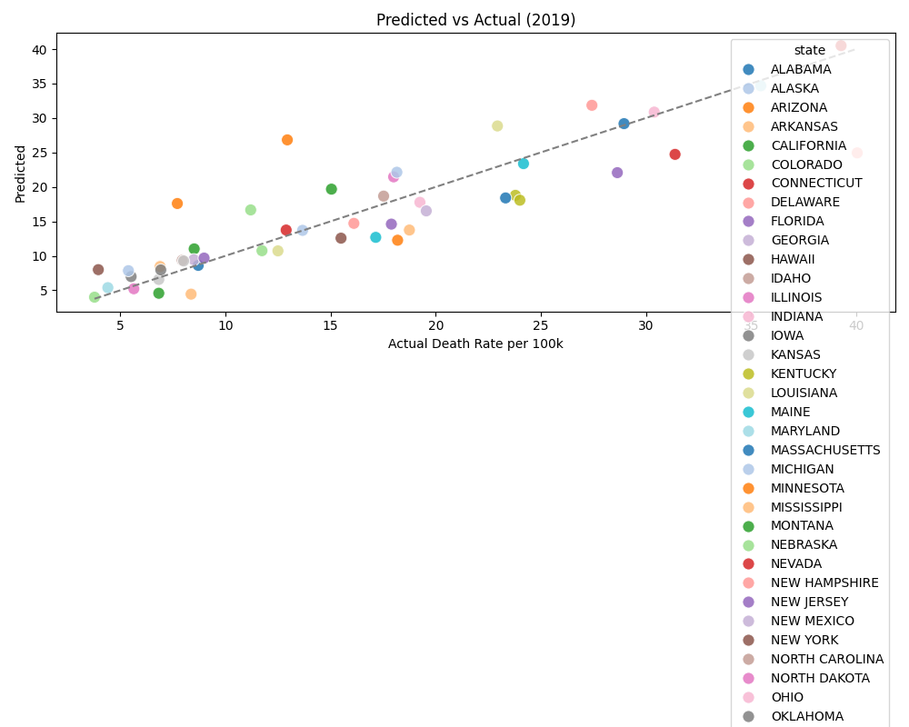
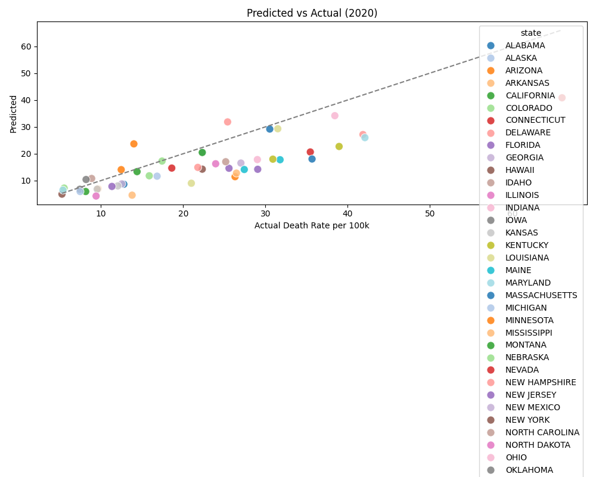
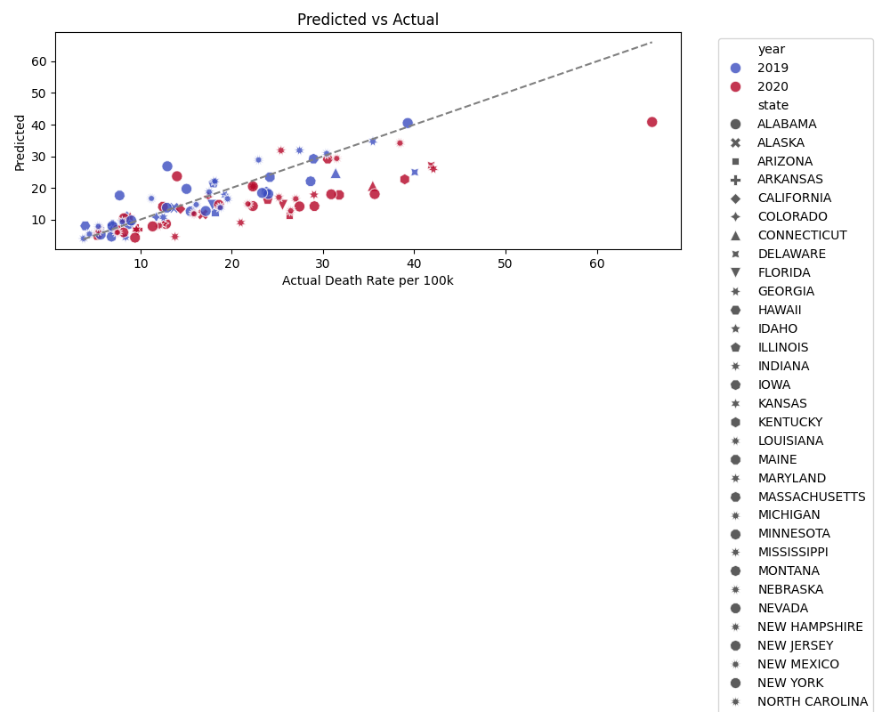
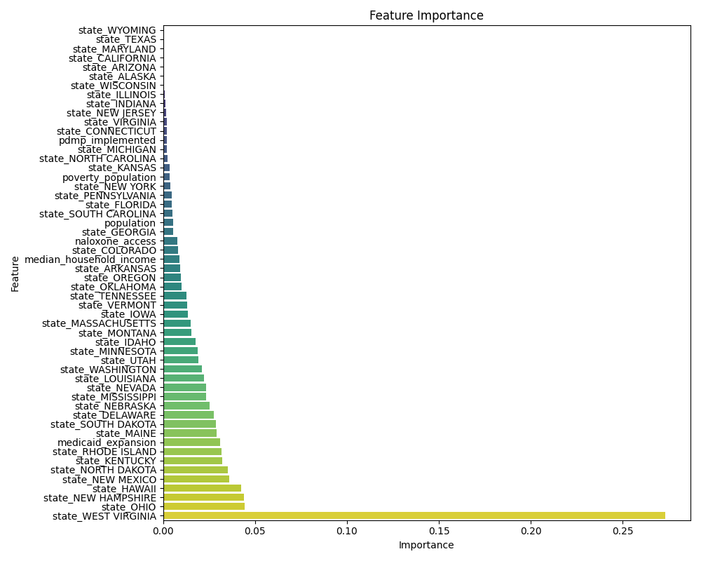

# 📊 Quantifying the Impact of State-Level Opioid Policies on Overdose Mortality in the U.S.
*A Predictive and Policy-Informed Data Science Approach*


---

## 🚀 Overview
This project analyzes the effectiveness of **state-level opioid policies** on overdose mortality across U.S. states (2010–2020).  
By integrating **policy variables (PDMP, Naloxone Access, Medicaid Expansion)** with **socio-economic controls** (poverty, unemployment, median income), we build a **state–year panel dataset**, conduct **policy evaluation (mixed/fixed effects)**, and train **ML models** for prediction and interpretation.  
The goal is to provide **policy-informed, data-driven insights** with an interactive **Streamlit dashboard**.

> **Why it matters:** The U.S. opioid crisis has caused hundreds of thousands of deaths. States adopted varied interventions with mixed outcomes. This project quantifies what works, where, and for whom—through transparent analysis and reproducible code.

---

## 🔗 Live Demo
- **Interactive Dashboard (Streamlit):** 👉 [Click here to view the live app](https://opioid-project-sp39r6jjfkw3nzsw3h8ybt.streamlit.app/)
- **Report PDF:** _coming soon_
- **Slides / 1-pager:** _coming soon_

---

## 🔬 Data & Sources
- **Mortality:** CDC WONDER / KFF (opioid overdose death rates)  
- **Policies:** PDAPS, NCSL (PDMP, Naloxone Access, Medicaid Expansion)  
- **Socio-economic:** KFF / Census (poverty, unemployment, median income)  

---

## ✏ Methods
**1) Preprocessing**  
- Standardize to `state-year` format  
- Encode policies as binary (0/1)  
- Merge socio-economic covariates  

**2) EDA**  
- Yearly trends and heatmaps  
- Cross-plots: poverty, unemployment, income vs mortality  
- Policy adoption timelines  

**3) Statistical Modeling**  
- **Mixed Effects Regression** (random effect: state)  
- Example: `medicaid_expansion` coefficient ≈ **+5.55**, *p* < 0.001  
- Weak causal interpretation with controls  

**4) Machine Learning**  
- Random Forest & XGBoost  
- **Best R² ≈ 0.575**  
- Feature importance: poverty, PDMP, Medicaid expansion  

---

## 📈 Key Findings
- **PDMP implementation:** +3.48, *p* = 0.003 → significant positive correlation  
- **Medicaid expansion:** +5.55, *p* < 0.001  
- **Poverty (scaled):** −2.47, *p* = 0.012  
- **Naloxone access / Unemployment:** not significant  
- **State random effect variance:** ~47  

> ⚠️ Note: Positive coefficients for PDMP/Medicaid likely reflect **policy lags, reporting differences, or confounding**, not “policies increase mortality.”  

---

## 📸 Selected Figures
  
  
  
  

---

## 🔁 Reproducibility
```bash
  # 1) Create environment
  conda create -n opioid-env python=3.10 -y
  conda activate opioid-env
  
  # 2) Install dependencies
  pip install -r requirements.txt
  
  # 3) (Optional) Rebuild panel data
  python src/merge_data.py
  
  # 4) Run EDA
  python src/eda_analysis.py
  
  # 5) Policy regressions
  python src/mixed_effects_regression.py
  
  # 6) ML forecasting
  python src/ml_forecast.py
  
  # 7) Launch dashboard
  streamlit run src/streamlit_app.py
```
---

## 🛠️ Tech Stack
- **Python**: pandas, numpy, matplotlib, seaborn, statsmodels, scikit-learn, xgboost, streamlit  
- **Visualization**: Streamlit, Plotly  
- **Version control**: GitHub  

---

## 📄 Deliverables
- 📊 Interactive Streamlit dashboard  
- 📘 PDF report  
- 📂 GitHub repository (with full pipeline & outputs)  
- 📝 1-page project summary (for resume/SOP)  

---

## ✍️ Author
**Xumo Zhu**  
UC San Diego · B.S. Math–Statistics & Probability (Gaduated in March,2025)  

- **GitHub:** [xumozhu](https://github.com/xumozhu)  
- **LinkedIn:** [Xumo Zhu](https://www.linkedin.com/in/xumo-z-a39b1524b/)  
- **Email:** xumozhu516@gmail.com
